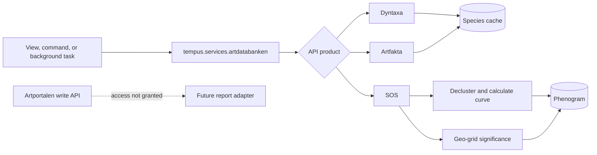

# Artdatabanken and Artportalen

Tempus uses several separate SLU Artdatabanken products:

- **Dyntaxa** supplies taxonomy and taxon IDs.
- **Artfakta** supplies species facts and habitat associations.
- **Species Observation System (SOS)** reads observations aggregated from
  multiple providers, including Artportalen.
- **Artportalen Read and Write** is a separate protected product for reporting
  observations into Artportalen. Tempus does not currently have access.

Reading Artportalen-origin data through SOS is not the same as using the
Artportalen write API.

| Product | Tempus use | Status |
|---|---|---|
| Dyntaxa Taxon Service | Search, normalize, cache, resync taxa | Implemented |
| Artfakta Species Information | Facts, landscape types, biotopes | Best-effort implementation |
| Species Observation System | Search/count/aggregate and phenograms | Implemented |
| Taxon List Service | Red-list and conservation lists | Not directly integrated |
| Artportalen Read and Write | Report observations | Access not granted |

## Integration flow

Continue with:

- [API products and implemented functions](apis.md)
- [Authentication and configuration](authentication.md)
- [Observations and phenograms](observations-and-phenograms.md)
- [Reporting to Artportalen](artportalen-write.md)

