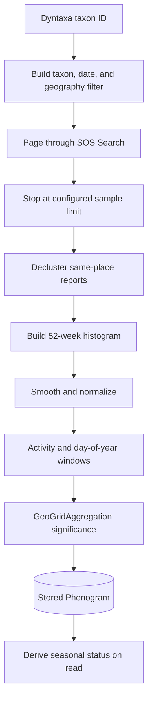

# SOS observations and phenograms

Historical SOS observations are converted into stored seasonal activity
curves. External crawling runs in background tasks; page rendering reads stored
`Phenogram` rows.

## Typical search filter

```json
{
  "date": {
    "startDate": "2019-01-01",
    "endDate": "2026-08-30",
    "dateFilterType": "BetweenStartDateAndEndDate"
  },
  "occurrenceStatus": "Present",
  "taxon": {"ids": [102822], "includeUnderlyingTaxa": true},
  "geographics": {
    "geometries": [{"type": "MultiPolygon", "coordinates": []}]
  }
}
```

Geography is omitted for a whole-range curve. Exact fields and enum values must
be checked against the current SOS OpenAPI document.

## Calculation



Current defaults:

- eight years of history, maximum 30;
- one-week smoothing;
- sample cap of 4,000 records;
- declustering enabled;
- geo-grid zoom 10 for significance;
- area-wide grid counts cached for 24 hours.

Declustering reduces duplicate reports from many observers visiting the same
individual. Occupied grid cells are less sensitive to such pile-ons than raw
report counts and are used for significance.

## Background work

`generate_phenogram` builds one species/area combination.
`fan_out_species_phenograms` and `fan_out_area_phenograms` enqueue individual
builds. `resync_phenograms` selects stale, missing, explicit, or all species.
Never execute the expensive build from a render path; a missing curve may
enqueue work and return `202` until a worker stores it.

## Interpretation and protection

- Public SOS data may generalize sensitive coordinates; protected OAuth access
  is not implemented.
- A missing record is not evidence of absence. Observer effort, provider
  coverage, protection, and sampling all affect results.
- Reports, individuals, and occupied locations are distinct measures.
- Common taxa may exceed the 10,000-row window; current phenograms use a sample.
  Add exports or aggregations if complete bulk history becomes necessary.

