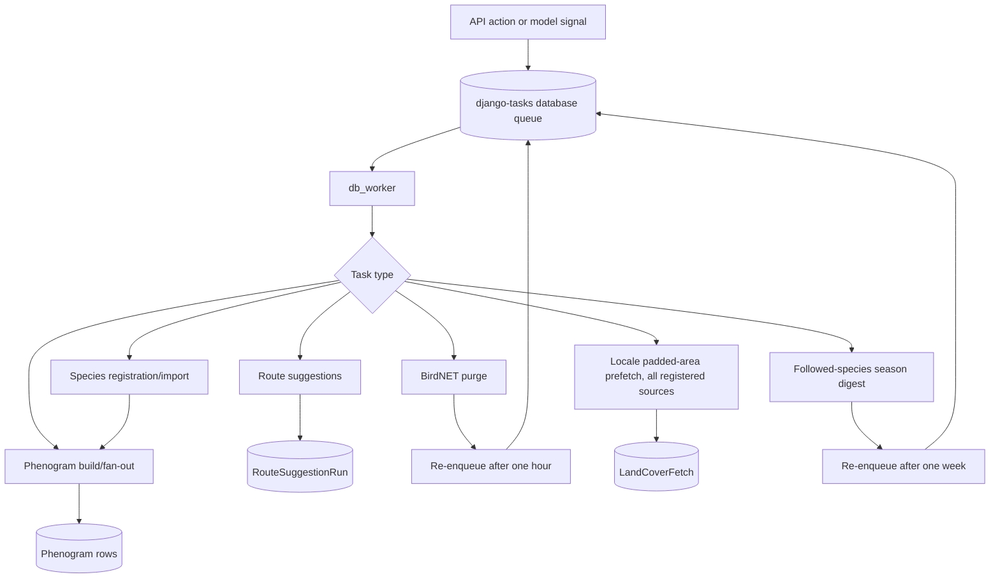

# Background tasks

Tempus uses `django-tasks` with `django-tasks-db` by default. Expensive SOS
crawls, bulk imports, and route suggestions must not block HTTP requests.

Run the worker as a separate process:

```powershell
python manage.py db_worker
```

`TASKS_BACKEND=django_tasks.backends.immediate.ImmediateBackend` executes tasks
inline and is intended for development/testing, not normal production work.

## Task inventory

| Task | Purpose | Trigger |
|---|---|---|
| `import_species_checklist` | Register a CSV batch, then queue phenograms | Species CSV import API |
| `register_species_from_api` | Register one taxon under a category | Internal/background use |
| `generate_phenogram` | Build one species/area curve | Species action or fan-out |
| `fan_out_species_phenograms` | Queue one build per GeoArea for a species | Registration/resync/signals |
| `fan_out_area_phenograms` | Queue one build per species for an area | New GeoArea/signals |
| `compute_route_suggestions` | Calculate and persist one route suggestion run | Route suggested-stops POST |
| `fetch_locale_land_cover` | Prefetch a Locale's padded area (5 km) from every source registered in `tempus/services/locale_sources.py` — currently land cover, hydrography, place names (Lantmäteriet), buildings (OpenStreetMap), roads (Trafikverket) | Locale `post_save` signal (create or geometry change) |
| `notify_followed_species_season_start` | Weekly digest notification for followed species entering season in 7-14 days | Self-rescheduling, runs each Sunday |
| `purge_birdnet_detections` | Delete detections older than 24 hours | Initial deployment enqueue, then itself |

## Flow



## Failure behavior

- Checklist import skips individual upstream taxon failures but fails when API
  configuration is missing for the entire batch.
- Phenogram builds log expected Artdatabanken configuration/API errors and end
  without retrying them automatically.
- Route calculations persist `failed` and an error message. Unexpected errors
  are also re-raised so the task backend records failure.
- Missing species, area, category, or route rows cause their task to exit.
- BirdNET purge deletes by `detected_at`, logs the count, and schedules itself
  again. Start one chain after deployment; repeated manual starts create
  redundant recurring chains even though deletion itself is safe.
- `fetch_locale_land_cover` persists `failed` with an error message on the
  `LandCoverFetch` row if any registered source's fetch fails; previous
  successful results (for every source) are left untouched. It skips all
  fetches entirely when the previously fetched area already covers the
  Locale's current padded bounding box. See
  [land-cover-fetch-handoff.md](land-cover-fetch-handoff.md) and
  [adding-a-locale-data-source.md](adding-a-locale-data-source.md#the-source-registry).
- `notify_followed_species_season_start` only runs its notification logic on
  Sunday; on other days it just re-enqueues itself for the next Sunday. It
  re-enqueues itself weekly regardless of outcome, so it only needs to be
  started once (like the BirdNET purge chain).

## Operational checks

- Ensure exactly the intended number of workers is running.
- Monitor queued/failed database tasks and `RouteSuggestionRun` failures.
- Confirm API keys and the global Artdatabanken cooldown are shared by workers.
- After deployment, ensure the BirdNET purge chain and the followed-species
  season digest (`notify_followed_species_season_start`) have each been
  started once.
- Avoid immediate-backend configuration in production because expensive work
  would run inside requests.

