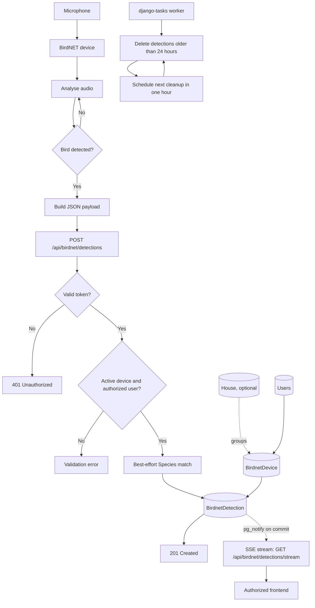

# BirdNET

BirdNET receives short-lived acoustic detections from field devices. A device
belongs to one or more users and can optionally be associated with a house.
Detections are retained for 24 hours. Authorized frontends read new detections
live over a Server-Sent Events stream.

## Domain model

```text
User * ───────── * BirdnetDevice
                       │
                       ├── 0..1 verso.House
                       └── 1 ───── * BirdnetDetection
                                          └── 0..1 Species
```

`BirdnetDevice` contains a UUID, unique `identifier`, display `name`, `users`,
optional `house`, `is_active`, and timestamps. If a house is selected, the
requesting user and all device users must be members of it.

`BirdnetDetection` contains the required `device`, received
`scientific_name`, optional matched `species`, confidence from 0 to 1,
`detected_at`, and `created_at`. Deleting a device cascades to its detections;
deleting a species leaves the received scientific name intact.

## Flow



## Status

- Models, device CRUD, ingest, SSE stream (PostgreSQL `LISTEN`/`NOTIFY` with a
  polling fallback), cleanup task, admin, fake-data command, and ingest/stream
  tests (`tempus/tests/test_birdnet.py`): implemented.
- Migration from the old free-text `device_id` to the device relation: existing
  values must be mapped during migration.

See [API contract](api.md) and [fake data](fake-data.md).

