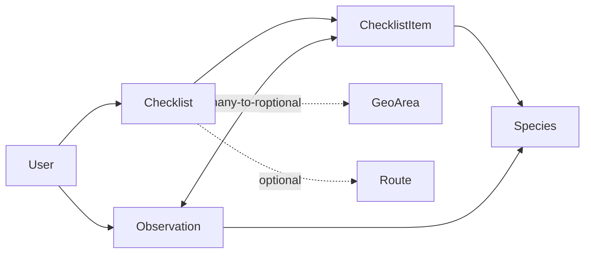
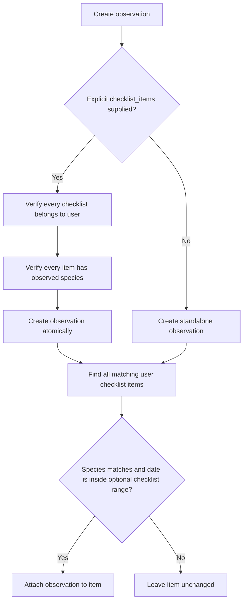

# Observations and checklists

Checklists describe species a user wants to find. Observations are durable,
user-owned sightings. Completion is derived from links between observations and
checklist items; it is not stored as a separate boolean.

## Model relationships



### Checklist

Contains owner, name, description, optional start/end dates, optional
`GeoArea`, optional `Route`, and timestamps. The route must belong to the same
user. If both dates are present, the end cannot precede the start.

### Checklist item

Connects one species to a checklist with sequence and notes. Species and
sequence are each unique within the checklist. `is_completed` in the API is
derived from whether at least one observation is linked.

### Observation

Contains owner, species, observed time, GeoJSON Point, optional positive count,
notes, creation time, and zero or more checklist items. Species deletion is
protected while observations reference it.

## Automatic completion



One observation can complete matching items in several checklists. Updating an
observation re-runs automatic linking. Explicit item lists are deduplicated,
must all belong to the user, and must all refer to one species.

## API

- `/api/tempus/checklists/`: user-scoped CRUD; filters `start_date`, `geo_area`,
  and `route`. Responses include derived `species_count`.
- `/api/tempus/checklist-items/`: user-scoped CRUD; filters `checklist` and
  `species`.
- `/api/tempus/observations/`: user-scoped CRUD; filters `species` and
  `checklist_items`.

Example observation:

```json
{
  "species": "<species-uuid>",
  "checklist_items": ["<item-uuid>"],
  "observed_at": "2026-08-30T10:15:00+02:00",
  "location": {"type": "Point", "coordinates": [14.1567, 56.0294]},
  "count": 2,
  "notes": "Two individuals calling"
}
```

These are internal Tempus observations. They are not automatically reported to
Artportalen; see [Artportalen reporting](artdatabanken/artportalen-write.md).

