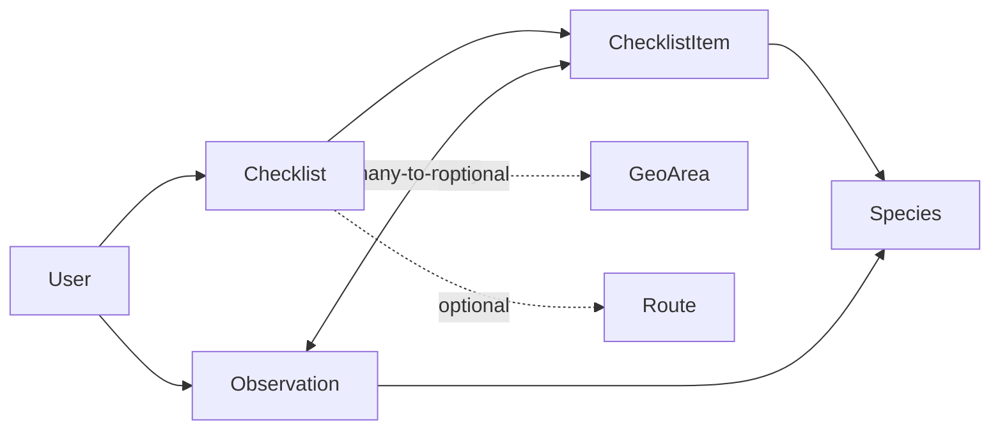
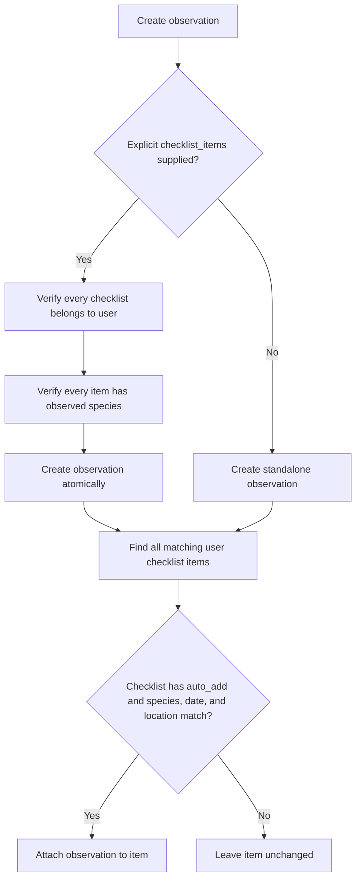

# Observations and checklists

Checklists describe species a user wants to find. Observations are durable,
user-owned sightings. Completion is derived from links between observations and
checklist items; it is not stored as a separate boolean.

## Model relationships



### Checklist

Contains owner, name, description, optional start/end dates, optional
`GeoArea`, optional `Route`, `auto_add`, and timestamps. The route must belong
to the same user. If both dates are present, the end cannot precede the start.
When `auto_add` is false, observations can still be explicitly registered on
the checklist, but are never automatically linked to it.

### Checklist item

Connects one species to a checklist with sequence and notes. Species and
sequence are each unique within the checklist. `is_completed` in the API is
derived from whether at least one observation is linked.

### Observation

Contains owner, species, observed time, GeoJSON Point, optional positive count,
notes, creation time, and zero or more checklist items. Species deletion is
protected while observations reference it.

## Automatic completion



One observation can complete matching items in several checklists. Updating an
observation re-runs automatic linking. Creating or updating a checklist also
backfills qualifying existing observations. Automatic linking requires
`auto_add: true`, the same species, a date within the optional range, and—when
the checklist has a `GeoArea`—a location inside that area's polygon. Explicit
item lists are deduplicated, must all belong to the user, and must all refer to
one species.

## Checklist choices on species

The regular species list and detail responses include `checklists`, scoped to
the authenticated user's checklists. Each entry contains the checklist `id`,
display `name`, and the matching checklist item's `item_id`:

```json
{
  "id": "<species-uuid>",
  "checklists": [
    {
      "id": "<checklist-uuid>",
      "name": "Spring birds",
      "item_id": "<checklist-item-uuid>"
    }
  ]
}
```

Use `item_id`, rather than the checklist ID, in an observation's
`checklist_items` array for explicit registration.

## API

- `/api/tempus/checklists/`: user-scoped CRUD; filters `start_date`, `geo_area`,
  and `route`. Responses include `auto_add` and derived `species_count`.
- `/api/tempus/checklist-items/`: user-scoped CRUD; filters `checklist` and
  `species`.
- `/api/tempus/observations/`: user-scoped CRUD; filters `checklist_items` and
  `species`. The `species` filter accepts either a Species UUID or a Dyntaxa
  taxon id; `species` in the request body accepts the same two forms.

Example observation:

```json
{
  "species": "<species-uuid or dyntaxa-taxon-id>",
  "checklist_items": ["<item-uuid>"],
  "observed_at": "2026-08-30T10:15:00+02:00",
  "location": {"type": "Point", "coordinates": [14.1567, 56.0294]},
  "count": 2,
  "notes": "Two individuals calling"
}
```

A non-browser client can create observations with a token — see
[Registrera en Tempus-observation med User token](extern-klient-observationer.md).

These are internal Tempus observations. They are not automatically reported to
Artportalen; see [Artportalen reporting](artdatabanken/artportalen-write.md).
