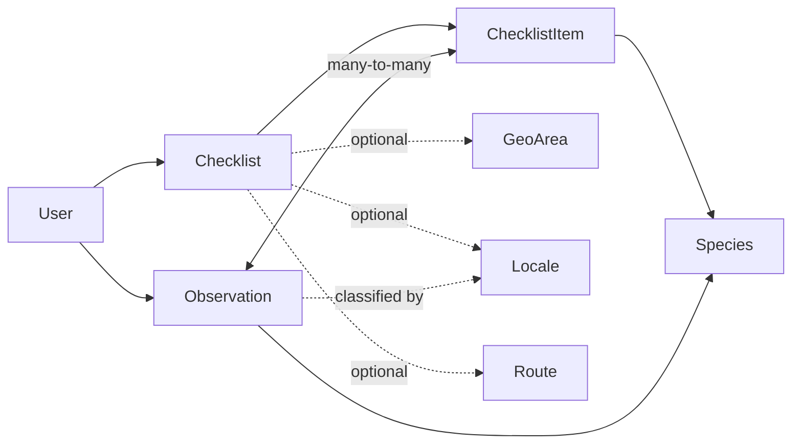
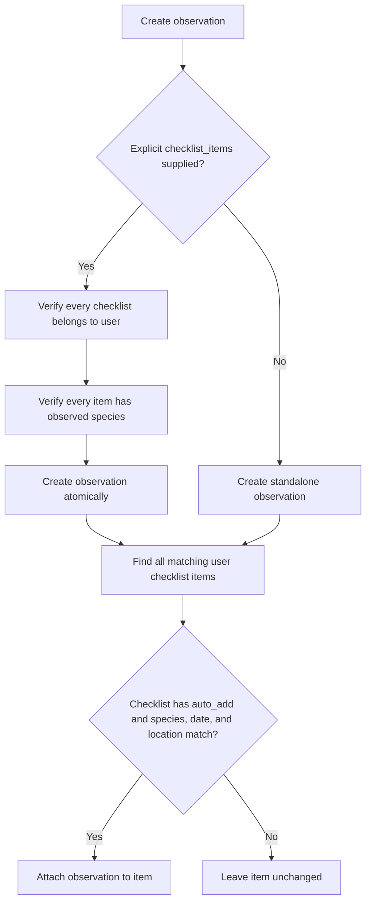

# Observations and checklists

Checklists describe species a user wants to find. Observations are durable,
user-owned sightings. Completion is derived from links between observations and
checklist items; it is not stored as a separate boolean.

## Model relationships



### Locales

A Locale is a user-owned named GeoJSON `MultiPolygon`. Clients manage their
own locales through `/api/tempus/locales/`; the server supplies the `user`
field, which is read-only. Locales use the same longitude/latitude coordinate
order as every other GeoJSON value in Tempus.

An observation's `locale` is read-only and is assigned from the current user's
Locales when the observation is created. A checklist can use an optional Locale
as a location scope, and it must belong to the checklist's owner.

### Checklist

Contains owner, name, description, optional start/end dates, optional
`GeoArea`, optional `Route`, `auto_add`, and timestamps. The route must belong
to the same user. If both dates are present, the end cannot precede the start.
When `auto_add` is false, observations can still be explicitly registered on
the checklist, but are never automatically linked to it.

### Checklist item

Connects one species to a checklist with sequence and notes. Species and
sequence are each unique within the checklist. `is_completed` in the API is
derived from whether at least one observation is linked.

### Observation

Contains owner, species, observed time, GeoJSON Point, optional positive count,
optional `life_stage`, notes, creation time, and zero or more checklist items.
`life_stage` is included in observation create, update, and read payloads.
Species deletion is protected while observations reference it.

## Automatic completion



One observation can complete matching items in several checklists. Updating an
observation re-runs automatic linking. Creating or updating a checklist also
backfills qualifying existing observations. Automatic linking requires
`auto_add: true`, the same species, a date within the optional range, and—when
the checklist has a `Locale` or `GeoArea`—a location inside either polygon. A
checklist with neither area has no location restriction. Explicit item lists
are deduplicated, must all belong to the user, and must all refer to one
species.

## Checklist choices on species

The regular species list and detail responses include `checklists`, scoped to
the authenticated user's checklists. Each entry contains the checklist `id`,
 display `name`, `auto_add` setting, and the matching checklist item's `item_id`:

```json
{
  "id": "<species-uuid>",
  "checklists": [
    {
      "id": "<checklist-uuid>",
      "name": "Spring birds",
      "auto_add": true,
      "item_id": "<checklist-item-uuid>"
    }
  ]
}
```

Use `item_id`, rather than the checklist ID, in an observation's
`checklist_items` array for explicit registration.

## Checklist register rows

`GET /api/tempus/checklists/{checklistId}/register/` returns paginated
checklist-item rows. Each row's `id` is the `ChecklistItem` UUID (not the
checklist UUID). Use that value when deleting a species from a checklist:

```http
DELETE /api/tempus/checklist-items/{row.id}/
```

Example row:

```json
{
  "id": "<checklist-item-uuid>",
  "sequence": 1,
  "notes": "",
  "species_id": "<species-uuid>",
  "swedish_name": "Koltrast",
  "scientific_name": "Turdus merula",
  "dyntaxa_taxon_id": 102822,
  "is_observed": false,
  "latest_observation_id": null
}
```

## Update a checklist from a species category

When a category has gained new species, synchronize the checklist with:

```http
POST /api/tempus/checklists/{checklistId}/sync-category/
Content-Type: application/json

{
  "species_category_id": "<category-uuid>"
}
```

The category UUID is the `id` returned by the species-category API. Species
assigned to the selected category or any of its subcategories are considered.
Only missing species are added: existing checklist items, their notes, and
their ordering are left unchanged. Newly added items are appended in
scientific-name order.

The endpoint also backfills qualifying observations for the new items when the
checklist's `auto_add` setting is enabled. It returns `200 OK`, including the
number of added species and the checklist's resulting species count:

```json
{
  "species_category_id": "<category-uuid>",
  "species_added": 12,
  "species_count": 58
}
```

Calling the endpoint again with the same category is safe; it returns
`"species_added": 0` until the category receives more species. It does not
remove species from the checklist, including species that no longer belong to
the category.

## API

- `/api/tempus/checklists/`: user-scoped CRUD; filters `start_date`, `geo_area`,
  and `route`. Responses include `auto_add` and derived `species_count`.
- `POST /api/tempus/checklists/{checklistId}/sync-category/`: adds every missing
  species in a category and its subcategories. Send
  `{"species_category_id": "<category-uuid>"}`. Existing checklist items are
  retained; the response includes `species_added` and the new `species_count`.
- `/api/tempus/checklist-items/`: user-scoped CRUD; filters `checklist` and
  `species`.
- `/api/tempus/observations/`: user-scoped CRUD; filters `checklist_items` and
  `species`. The `species` filter accepts either a Species UUID or a Dyntaxa
  taxon id; `species` in the request body accepts the same two forms. `GET`
  list and detail responses include the read-only `species_detail` object with
  the species' `dyntaxa_taxon_id` and `swedish_name`.

Example observation:

```json
{
  "species": "<species-uuid or dyntaxa-taxon-id>",
  "checklist_items": ["<item-uuid>"],
  "observed_at": "2026-08-30T10:15:00+02:00",
  "location": {"type": "Point", "coordinates": [14.1567, 56.0294]},
  "count": 2,
  "notes": "Two individuals calling"
}
```

Example response:

```json
{
  "id": "<observation-uuid>",
  "species": "<species-uuid>",
  "species_detail": {
    "dyntaxa_taxon_id": 102822,
    "swedish_name": "Koltrast"
  }
}
```

A non-browser client can create observations with a token — see
[Registrera en Tempus-observation med User token](extern-klient-observationer.md).

These are internal Tempus observations. They are not automatically reported to
Artportalen; see [Artportalen reporting](artdatabanken/artportalen-write.md).
