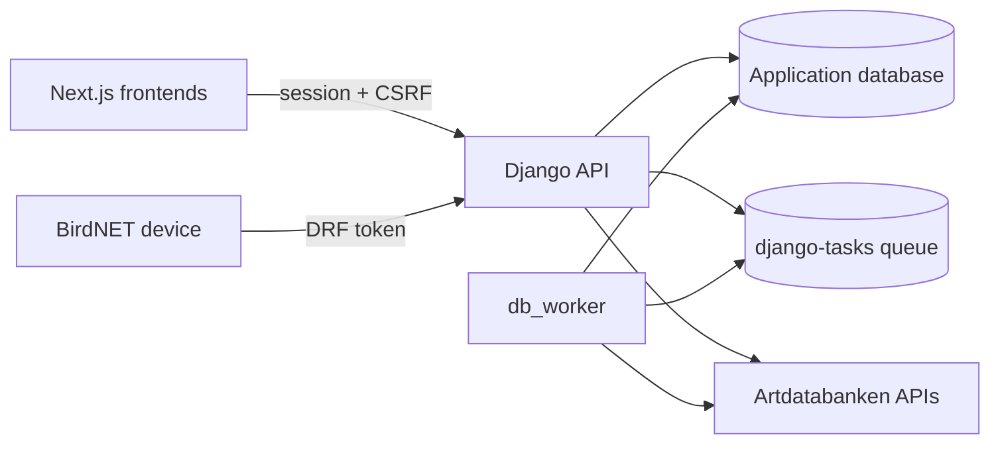

# Operations and configuration

## Runtime components

Production needs the Django API, database, static-file serving, and at least one
database task worker. BirdNET and external integrations additionally need their
credentials and scheduled bootstrap steps.

The BirdNET SSE stream (`GET /api/birdnet/detections/stream`) holds one
worker/thread per open connection. On PostgreSQL it blocks on
`LISTEN`/`NOTIFY` (channel `birdnet_detection`) rather than polling, and opens
one extra database connection per open stream for that `LISTEN` - size the
database connection limit and the worker pool for the expected number of
concurrent viewers. Serve it from a deployment that streams responses (an async
server or a dedicated `gthread` pool, never plain sync workers) and disable
response buffering on any proxy in front of it; the view sends
`X-Accel-Buffering: no` for nginx. Without PostgreSQL the stream polls once a
second instead.

## Core environment

| Variable | Purpose |
|---|---|
| `SECRET_KEY` | Django signing secret |
| `DEBUG` | Debug mode |
| `DOMAINS` | Comma-separated root domains |
| `API_SUBDOMAIN` | API subdomain label |
| `FRONTEND_SUBDOMAINS` | Allowed frontend subdomain labels |
| `FRONTEND_DEV_PORTS` | Local frontend ports |
| `ALLOWED_HOSTS` | Optional explicit host override |
| `DATABASE_URL` | Production database connection |
| `DB_CONN_MAX_AGE` | Persistent connection lifetime |
| `ROOT_DOMAIN` | Session/CSRF cookie domain root |
| `CORS_ALLOWED_ORIGINS` | Optional explicit credentialed CORS origins |
| `CSRF_TRUSTED_ORIGINS` | Optional explicit CSRF origin list |
| `TASKS_BACKEND` | django-tasks backend |

Artdatabanken variables are listed in
[authentication and configuration](artdatabanken/authentication.md).

## Authentication paths

- Frontends use shared cross-subdomain session cookies. Credentialed CORS and
  CSRF trusted origins must match deployed frontend/API domains.
- BirdNET ingest uses a DRF token belonging to a user attached to the device.
  Tokens must be rotated and stored as secrets on the field device.
- Artdatabanken products use separate subscription keys; protected/write OAuth
  is not currently implemented.

## Deployment checklist

1. Apply the project's normal reviewed migration process.
2. Configure database, domains, CORS, CSRF, and session-cookie scope.
3. Configure the required Artdatabanken product keys and descriptive user agent.
4. Start the Django API and `db_worker` as separately supervised processes.
5. Start the BirdNET purge task chain once.
6. Create/associate BirdNET devices and issue device-user tokens securely.
7. Verify species search, one background phenogram, route suggestion polling,
   BirdNET ingest, and the BirdNET SSE stream before enabling clients.
8. Monitor upstream API errors, slow calls, queued/failed tasks, and database
   connection usage.

## Maintenance commands

| Command | Purpose |
|---|---|
| `python manage.py db_worker` | Run database task worker |
| `python manage.py resync_species` | Refresh stale/selected species cache |
| `python manage.py resync_phenograms` | Queue stale/selected curve rebuilds |
| `python manage.py fake_birdnet_detections` | Generate local BirdNET test data |

Run commands deliberately in the intended environment. Fake-data generation is
for development and produces ordinary rows that later qualify for retention
cleanup.

