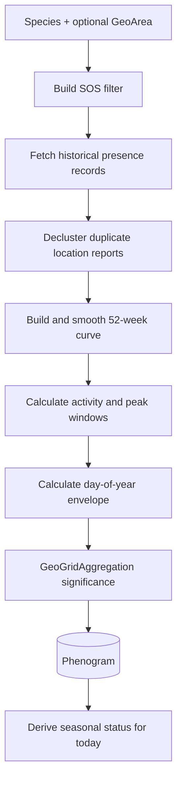

# Phenograms

A phenogram is a stored seasonal activity curve for one `Species`, optionally
restricted to one `GeoArea`. It is calculated from historical observations in
SLU Artdatabanken's Species Observation System (SOS).

One row exists per species, area, and year span. A null `geo_area` means the
whole available range without a polygon filter.

## Stored data

`Phenogram.weeks` contains 52 entries with raw count, smoothed value, and
normalized annual fraction. The model also stores peak/activity weeks, a
day-of-year envelope, confidence, geographic significance, source window,
sample provenance, and computation time.

The day-of-year envelope can cross New Year. For example, a start at day 320
and end at day 40 is valid.

## Build flow

Current defaults are eight years of history, one-week smoothing, declustering,
and at most 4,000 fetched records. The maximum supported span is 30 years.
Area-wide occupied-cell counts used by significance are cached for 24 hours.

## Seasonal status

Status is derived on read and is never stored as a boolean. The response gives:

- `out_of_season`
- `coming_into_season`
- `in_season`
- `at_peak`
- `going_out_of_season`

It also includes overlapping booleans and days until the activity-window edges.
“Coming” currently means within 21 days before the start; “going out” means the
last 14 days before the end.

## API

### Browse stored curves

`GET /api/tempus/phenograms/`

Filters: `species`, `geo_area`, `years`, and `status`. This is read-only and
never triggers a rebuild.

### One species

`GET /api/tempus/species/{species-id}/phenogram/`

Returns an existing curve. If missing, the endpoint queues a background build
and returns `202`. A refresh request queues rebuilding even if a row exists.

### Bulk generation

`POST /api/tempus/species/generate-phenograms/` is staff-only. It accepts
optional `taxa`, `all`, and `refresh` values and returns `202` after fan-out.

## Background tasks and CLI

- `generate_phenogram`: one species/area build.
- `fan_out_species_phenograms`: one species across areas.
- `fan_out_area_phenograms`: one area across species.
- `python manage.py resync_phenograms`: select missing/stale curves and enqueue
  work; supports `--older-than`, `--all`, repeatable `--taxon`, `--no-refresh`,
  and `--dry-run`.

The database task worker must be running. Rendering must never perform the SOS
crawl synchronously. See [SOS observations and phenograms](artdatabanken/observations-and-phenograms.md)
for sampling and interpretation limits.

