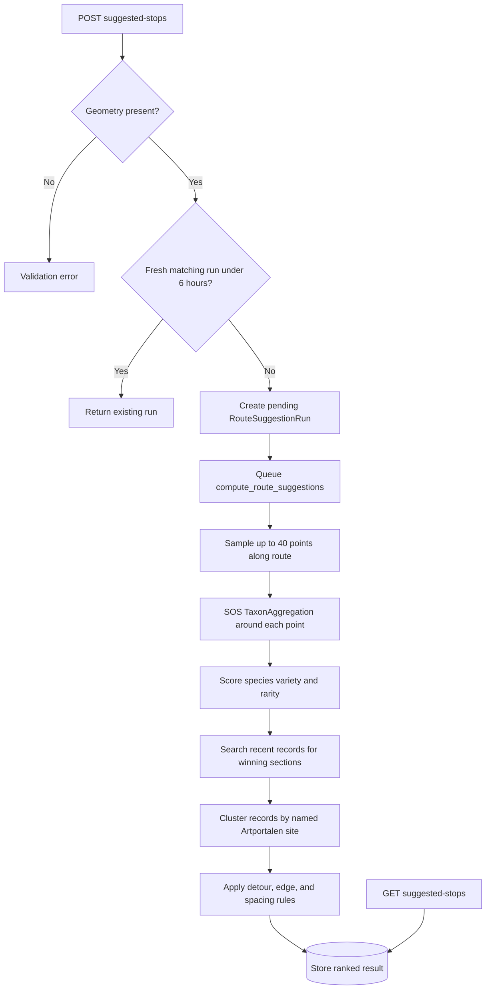

# Routes and suggested stops

Routes are user-owned planned journeys represented by GeoJSON. Tempus can also
calculate nature-oriented rest-stop suggestions from recent SOS observations.

## Models

### `Route`

- UUID and owning user;
- name and planned date;
- GeoJSON `LineString` geometry in WGS 84 longitude/latitude order;
- `corridor_metres`, controlling the observation search radius;
- creation and update timestamps.

### `RouteStop`

- parent route and unique sequence within it;
- name;
- GeoJSON `Point` location;
- optional planned time.

### `RouteSuggestionRun`

Stores the latest asynchronous suggestion calculation for a route: parameters,
`pending`/`running`/`succeeded`/`failed` status, result, error, and timestamps.

## API and permissions

- `/api/tempus/routes/`: user-scoped CRUD; filter by `planned_date`.
- `/api/tempus/route-stops/`: user-scoped CRUD; filter by `route`.
- `/api/tempus/routes/{id}/suggested-stops/`: suggestion workflow.

Users cannot access other users' routes or attach stops/checklists to them.
Route geometry must be a GeoJSON `LineString`; stop locations must be Points.

## Suggestion workflow

`POST` starts or reuses a run and normally returns `202`. `GET` returns the
current run for polling, or `404` before the first run. `GET ?sync=true` runs
inline for debugging only and may take minutes or time out.

Optional parameters:

| Parameter | Meaning |
|---|---|
| `taxon_id` | Restrict to a Dyntaxa subtree |
| `since_days` | Observation window, 1–365 days |
| `notable_days` | Recent-notable cutoff, 1–365 days |
| `max_detour_m` | Maximum distance away from route |
| `num_stops` | Requested result count, 1–25 |
| `edge_buffer_m` | Exclude stops near start/end |
| `min_gap_m` | Minimum along-route spacing |
| `refresh=true` | Ignore a fresh cached run |

## Scoring and caching

The planner ranks species variety and rarity, not raw report volume. Rarity is
read from area-specific phenogram significance where possible, then from the
species-wide significance. Winning sections are localized to named observation
sites; unnamed or low-variety points are discarded.

Observation responses are cached for six hours. One run can still make dozens
of rate-limited SOS calls, so production calculation belongs in the task worker.
Individual sample failures are skipped; a completely unscored route returns no
suggestions.

