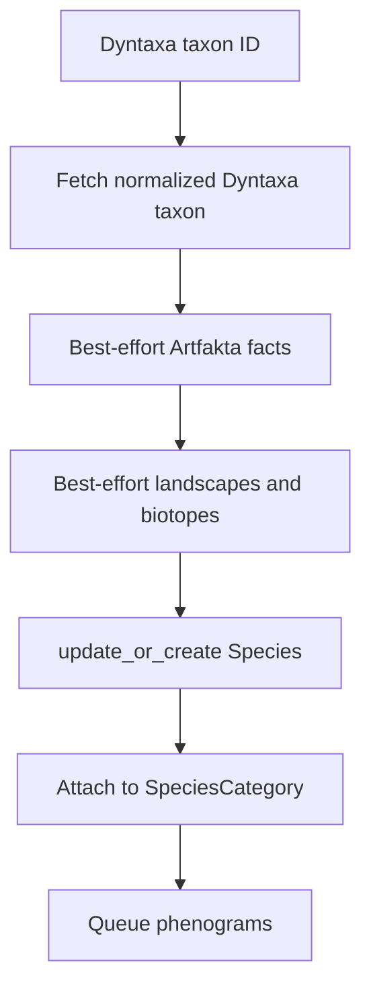

# Species and taxonomy

`Species` is Tempus's local cache and reference for a Dyntaxa taxon. Dyntaxa
remains the taxonomy source of truth.

## Identifiers

- `Species.id`: internal UUID used by most relational APIs.
- `Species.dyntaxa_taxon_id`: unique external ID used for Dyntaxa, SOS filters,
  species lookup routes, registration, and synchronization.

Do not substitute one for the other. The species router uses
`dyntaxa_taxon_id` as its URL lookup field.

## Cached fields

Scientific/Swedish name, rank, parent taxon ID, accepted/active state, raw API
data, Artfakta landscapes and biotopes, synchronization timestamp, and derived
whole-range observation significance. Area-specific significance belongs to a
`Phenogram`, not the species row.

Artfakta habitat significance (`stor`/`har`) is a different concept from the
0–1 observation rarity/significance score.

## Categories and follows

`SpeciesCategory` represents a useful taxonomic grouping. Membership is an
explicit list through the `SpeciesCategoryMembership` join model (unique per
category/species); species do not have to be inferred dynamically. The
category's `taxon_id` can identify any useful parent rank.

Categories form a tree: `parent_category` is a nullable self-reference
(`SET_NULL`, reverse `children`) and the API rejects an edit that would create
a cycle. `is_primary` flags the main categories a client should surface first,
and `image_url` holds an optional externally hosted illustration.

The API exposes both the direct members and the **effective** set:
`effective_species_ids()` is every species assigned to the category or any of
its descendants. The serializer returns `species` (effective ids),
`species_memberships` (direct join rows), and `species_count` (effective size).
The list endpoint returns a lighter payload than the detail view, is paginated,
and is addressed by `taxon_id` rather than the UUID
(`/api/tempus/species-categories/{taxon_id}/`). Filters: `taxon_id`,
`parent_category`, `is_primary`.

`SpeciesFollow` is user-owned and unique per user/species. It stores priority,
notification preference, notes, and creation time. API species representations
are annotated with whether the current user follows them. Besides normal
`DELETE /api/tempus/species-follows/{id}/`, a follow can be removed by Dyntaxa
taxon id with `DELETE /api/tempus/species-follows/unfollow/?species=<dyntaxa-id>`.

`POST /api/tempus/species/resolve/` takes `{ "ids": [<species-uuid>, ...] }`
(at most 100, unique) and returns the matching cached species. It is a
read-only bulk lookup for hydrating a client's stored id list; it never
registers or refreshes anything.

## Registration and synchronization

- Search: `GET /api/tempus/species/search/?q=...`; optional
  `under_taxon_id` and `limit`.
- Register: `POST /api/tempus/species/register/` with category UUID and Dyntaxa
  ID. This is a shared-data write and therefore staff-only.
- CSV import: `POST /api/tempus/species/import-checklist/` as multipart data.
  UTF-8 comma, semicolon, and tab exports with a `Taxon id` column are accepted;
  work continues in a background task.
- One-species resync: `POST /api/tempus/species/{dyntaxa-id}/resync/`.
- Bulk resync: `POST /api/tempus/species/resync/`; select explicit taxa, missing
  Artfakta fields, all rows, or stale rows.
- CLI resync: `python manage.py resync_species` supports `--older-than`, `--all`,
  repeatable `--taxon`, repeatable `--missing`, and `--dry-run`.

Artfakta failures do not block a Dyntaxa refresh. Missing taxonomy/API
configuration returns 503; upstream API errors generally return 502.

See [Artdatabanken APIs](artdatabanken/apis.md) for external operations.

