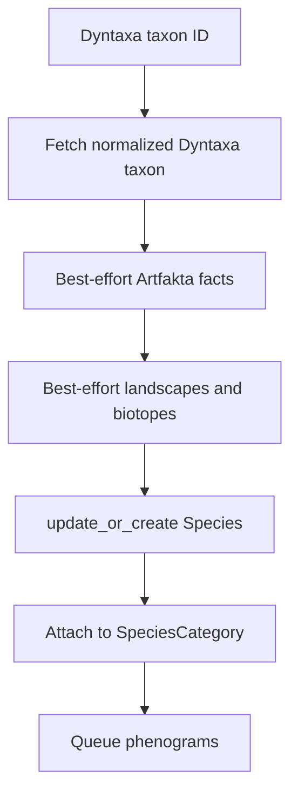

# Species and taxonomy

`Species` is Tempus's local cache and reference for a Dyntaxa taxon. Dyntaxa
remains the taxonomy source of truth.

## Identifiers

- `Species.id`: internal UUID used by most relational APIs.
- `Species.dyntaxa_taxon_id`: unique external ID used for Dyntaxa, SOS filters,
  species lookup routes, registration, and synchronization.

Do not substitute one for the other. The species router uses
`dyntaxa_taxon_id` as its URL lookup field.

## Cached fields

Scientific/Swedish name, rank, parent taxon ID, accepted/active state, raw API
data, Artfakta landscapes and biotopes, synchronization timestamp, and derived
whole-range observation significance. Area-specific significance belongs to a
`Phenogram`, not the species row.

Artfakta habitat significance (`stor`/`har`) is a different concept from the
0–1 observation rarity/significance score.

## Categories and follows

`SpeciesCategory` represents a useful taxonomic grouping and has an explicit
many-to-many species list. The category's `taxon_id` can identify any useful
parent rank; member species do not have to be inferred dynamically.

`SpeciesFollow` is user-owned and unique per user/species. It stores priority,
notification preference, notes, and creation time. API species representations
are annotated with whether the current user follows them.

## Registration and synchronization

- Search: `GET /api/tempus/species/search/?q=...`; optional
  `under_taxon_id` and `limit`.
- Register: `POST /api/tempus/species/register/` with category UUID and Dyntaxa
  ID. This is a shared-data write and therefore staff-only.
- CSV import: `POST /api/tempus/species/import-checklist/` as multipart data.
  UTF-8 comma, semicolon, and tab exports with a `Taxon id` column are accepted;
  work continues in a background task.
- One-species resync: `POST /api/tempus/species/{dyntaxa-id}/resync/`.
- Bulk resync: `POST /api/tempus/species/resync/`; select explicit taxa, missing
  Artfakta fields, all rows, or stale rows.
- CLI resync: `python manage.py resync_species` supports `--older-than`, `--all`,
  repeatable `--taxon`, repeatable `--missing`, and `--dry-run`.

Artfakta failures do not block a Dyntaxa refresh. Missing taxonomy/API
configuration returns 503; upstream API errors generally return 502.

See [Artdatabanken APIs](artdatabanken/apis.md) for external operations.

